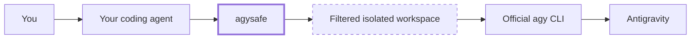
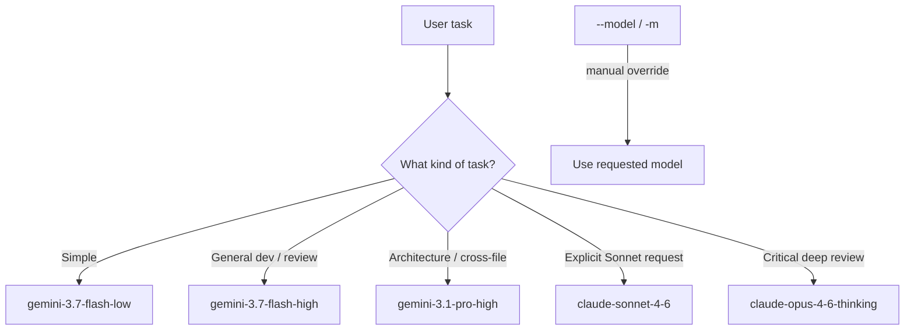
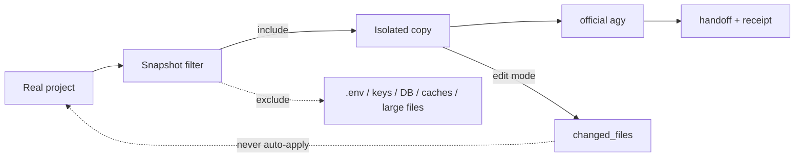

<div align="center">

# 🛡️ AgySafe

### Use the Antigravity benefits you already have — inside the coding agent you already use.

**Official AGY CLI · Agent-agnostic · Local-first · Safe by default**

[](CHANGELOG.md)
[](#requirements)
[](#how-it-works)
[](LICENSE)
[](SECURITY.md)

[中文说明](README_CN.md) · [Docs](docs/README.md) · [Quick Start](docs/QUICKSTART.md) · [Architecture](docs/ARCHITECTURE.md) · [Troubleshooting](docs/TROUBLESHOOTING.md) · [Agent Setup](docs/AGENT_SETUP.md)

</div>

---

## Why AgySafe?

You may already pay for Google AI / Antigravity access, while spending most of your day in **OpenCode, Codex, Claude Code, Gemini CLI, Cursor, or another coding agent**.

AgySafe connects those two worlds without turning itself into another heavy framework.



> **AgySafe is intentionally small at the core.**  
> One stable local CLI, one safety layer, many agent entry points.

---

## What problem does it solve?

| Without AgySafe | With AgySafe |
|---|---|
| Your preferred agent cannot directly use your AGY workflow | Any terminal-capable agent can call `agysafe` |
| Every agent needs a different custom integration | All adapters call the same universal CLI |
| Real project paths may be handed directly to another tool | Review/edit tasks use a filtered isolated copy |
| Secret files and local databases can be accidentally exposed | Common secrets, credentials, DBs, caches and large files are excluded |
| It is easy to confuse network failures with local bugs | AgySafe returns explicit statuses such as `NETWORK_ERROR` |
| Setup can feel too technical | Your own agent can configure and diagnose AgySafe for you |

---

## ✨ Core features

| | Capability | What it means |
|---|---|---|
| 🤖 | **Agent-agnostic** | Works through one `agysafe` CLI instead of a separate runtime per agent |
| 🧠 | **Automatic model routing** | Default is `Model=auto`; AgySafe selects a suitable AGY model from the task |
| 🎛️ | **Manual override** | Pin any supported model with `--model` / `-m` |
| 📦 | **Isolated snapshots** | Review/edit tasks work on a copied workspace rather than your real project |
| 🔐 | **Secret filtering** | Excludes `.env`, private keys, credentials, common DBs and high-confidence token patterns |
| 🧹 | **Noise filtering** | Skips `.git`, dependencies, caches, virtual environments and oversized files |
| 🪟 | **Windows-aware** | Handles PowerShell 5.1 encoding and reserved names such as `NUL`, `CON`, `COM1` |
| 🧾 | **Structured receipts** | Every run can return machine-readable JSON with model, mode, workspace and status |
| 🧯 | **Fail clearly** | Network, region, workspace, permission and output failures are surfaced instead of disguised |
| 🔌 | **Thin integrations** | OpenCode, Codex, Gemini CLI and other hosts reuse the same execution core |

---

# 🚀 Quick start

## Requirements

- Windows
- Windows PowerShell 5.1+
- official `agy` CLI installed
- AGY authentication already available on the machine

### 1. Install

```powershell
.\install.ps1
```

The installer:

- runs a local fake-AGY self-test;
- verifies the official `agy` executable;
- installs the global `agysafe` command;
- prepares the isolated AgySafe workspace root;
- installs integrations for supported agents when applicable.

Restart already-open agent applications after installation.

### 2. Use it anywhere

Automatic mode + automatic model:

```text
agysafe "review the current project"
```

Manual model:

```text
agysafe --model claude-sonnet-4-6 "review the current project"
```

Structured output for another agent:

```text
agysafe --workspace "." --json "review the current project"
```

### 3. Or use the native Agent entry point

**OpenCode / OpenCode CLI**

```text
/agy 审查一下当前项目
```

**Gemini CLI**

```text
/agy review the current project
```

**Codex / Codex CLI**

```text
Use AgySafe to review the current project.
```

---

## 🪄 Don't want to configure it yourself?

Let your own coding agent do it.

Paste this into Codex, OpenCode, Claude Code, or another terminal-capable agent:

```text
Help me set up this AgySafe repository on my Windows machine.

Please:
1. Read README.md and docs/AGENT_SETUP.md first.
2. Check that the official `agy` CLI is installed and `agy --version` works.
3. Run the repository's `install.ps1`.
4. Do not replace AGY authentication, use a reverse proxy, or modify unrelated system settings.
5. Verify `agysafe --doctor`.
6. Run only the short local/smoke tests documented by the project.
7. If something fails, diagnose which layer failed before changing any AgySafe source code.
8. Tell me exactly what you changed.
```

More ready-to-use prompts: **[Agent-assisted setup →](docs/AGENT_SETUP.md)**

---

# 🧩 Supported agents

AgySafe separates **core compatibility** from **host-specific convenience**.

### First-class integrations

| Agent | Integration | Typical UX |
|---|---|---|
| OpenCode | `/agy` command + Agent Skill | `/agy review this project` |
| OpenCode CLI | `/agy` command + Agent Skill | `/agy review this project` |
| Codex | Agent Skill + `AGENTS.md` guidance | `Use AgySafe to ...` |
| Codex CLI | Agent Skill + `AGENTS.md` guidance | `Use AgySafe to ...` |
| Gemini CLI | global custom `/agy` command | `/agy ...` |
| Claude Code | optional `CLAUDE.md` guidance | `Use AgySafe to ...` |
| Cursor / Cursor CLI | instruction template + universal CLI | `agysafe ...` |

### Universal compatibility

If an agent can execute a terminal command, it can use:

```text
agysafe --workspace "." --json "<task>"
```

This is the compatibility path for tools such as Windsurf, Cline, Roo Code, Continue, Aider and similar terminal-capable agents.

> Host integration formats may change.  
> The stable contract is the **`agysafe` CLI**, not any individual plugin format.

See **[Agent integration design →](docs/AGENT_INTEGRATION.md)**

---

# 🧠 Automatic model selection

The default is:

```text
Model=auto
Mode=auto
```

AgySafe makes a lightweight routing decision from the task.



You can always override it:

```text
agysafe -m gemini-3.1-pro-high "analyze the architecture"
```

Detailed routing behavior: **[Architecture →](docs/ARCHITECTURE.md)**

---

# 🔐 Safe by default

For project review/edit tasks, AgySafe does **not** hand the real project directory directly to AGY.



Default protections include:

- isolated project copy;
- common secret-file filtering;
- high-confidence token/key filtering;
- secret-like environment-variable cleanup;
- dependency/cache/build-directory filtering;
- sandbox mode;
- no dangerous permission-bypass flag;
- no automatic write-back from isolated edits to the real project.

Read the threat model and limits: **[SECURITY.md](SECURITY.md)**

---

# ⚙️ How it works

AgySafe has four deliberately small layers:

```text
┌───────────────────────────────────────────────┐
│  Agent UX                                     │
│  /agy · Agent Skill · AGENTS.md · terminal    │
├───────────────────────────────────────────────┤
│  Universal CLI                                │
│  agysafe --model auto --mode auto ...         │
├───────────────────────────────────────────────┤
│  Safety & routing                             │
│  snapshot · secrets · model · status          │
├───────────────────────────────────────────────┤
│  Official runtime                             │
│  agy CLI → Antigravity                        │
└───────────────────────────────────────────────┘
```

The project deliberately **does not** implement its own Antigravity protocol, authentication system, or reverse proxy.

That keeps the maintenance surface small.

Full design: **[Architecture →](docs/ARCHITECTURE.md)**

---

# 🧯 Something went wrong?

AgySafe is designed to be diagnosable by humans **and by other agents/LLMs**.

First:

```text
agysafe --doctor
```

Then use a short smoke test rather than repeatedly launching a 10-minute project review:

```text
agysafe --workspace "." --json --timeout 2 "只回复 OK"
```

Typical statuses include:

| Status | Meaning |
|---|---|
| `SUCCESS` | Completed normally |
| `NETWORK_ERROR` | AGY/service/network connection failed |
| `REGION_UNSUPPORTED` | Service reported a location restriction |
| `WORKSPACE_ERROR` | AGY could not see/use the delegated workspace |
| `PERMISSION_DENIED` | Required operation was denied |
| `NO_OUTPUT` | Process ended without usable output |
| `INCOMPLETE` | Review ended before producing a real result |
| `NO_CHANGES` | Edit mode completed without changed files |
| `SNAPSHOT_EMPTY` | Nothing safe/useful remained after snapshot filtering |

### Let your agent diagnose it

Paste this into your coding agent or ChatGPT-like assistant:

```text
Help me diagnose AgySafe, but do not change its source code first.

Please classify the failure into one of these layers:
1. host-agent integration;
2. AgySafe CLI/install/PATH;
3. snapshot/workspace isolation;
4. official `agy` CLI;
5. authentication/network/service/region.

Collect the minimum evidence needed:
- `Get-Command agysafe`
- `agysafe --doctor`
- `agy --version`
- the latest AgySafe JSON receipt/error
- a short `agysafe --workspace "." --json --timeout 2 "只回复 OK"` smoke test if appropriate.

Do not repeatedly rerun long AGY tasks.
Only propose a source-code patch if the evidence shows the bug is actually inside AgySafe.
Explain the root cause before making changes.
```

Full decision tree: **[Troubleshooting →](docs/TROUBLESHOOTING.md)**

---

# ✅ What has been verified

The v1.0 release path has been exercised with:

- **OpenCode**: full project review through automatic model routing, isolated snapshot, filtering and real AGY output.
- **Codex**: universal CLI invocation, automatic model selection and real AGY smoke test.
- **Windows self-test**: fake-AGY review/edit path, snapshot isolation, secret filtering and manual model override.
- **GitHub Actions**: Windows PowerShell parser + hermetic self-test workflow included in the repository.

AgySafe is still a young project. Reports from other agents and environments are welcome.

---

# 🗂️ Repository map

```text
AgySafe/
├─ bin/                         # universal CLI + runtime
├─ integrations/                # thin host adapters/templates
├─ docs/                        # architecture, setup, troubleshooting
├─ tests/                       # hermetic fake-AGY tests
├─ .github/                     # CI + issue/PR templates
├─ install.ps1
├─ uninstall.ps1
├─ SECURITY.md
├─ CONTRIBUTING.md
└─ README.md
```

---

# 🧭 Project philosophy

AgySafe follows five rules:

**1. Official runtime first**  
Use the official AGY CLI rather than rebuilding the Antigravity protocol.

**2. One core, many agents**  
Agent integrations stay thin. They never fork authentication or workspace logic.

**3. Secure by default, quiet by default**  
Safety should happen automatically rather than becoming a burden for everyday use.

**4. Automatic by default, overridable when needed**  
Users should normally type a task, not configure a router.

**5. Diagnose before patching**  
A network outage should not trigger a new AgySafe version.

---

# 🛣️ Roadmap

- [x] Universal Windows CLI
- [x] OpenCode integration
- [x] Codex integration guidance
- [x] Gemini CLI custom command
- [x] Claude Code guidance
- [x] Cursor/generic Agent templates
- [x] Automatic + manual model selection
- [x] Snapshot and secret filtering
- [x] Structured receipts and status classification
- [x] Windows CI self-test
- [ ] More verified Agent hosts
- [ ] Cleaner edit-review/apply workflow
- [ ] macOS/Linux support
- [ ] Optional installer UX improvements

Have an agent that works well with AgySafe? Open an issue and add it to the verified matrix.

---

# 🤝 Contributing

AgySafe is deliberately compact. Contributions should preserve that.

Before adding a new agent integration, ask:

> Can this be implemented as a thin adapter around the existing `agysafe` CLI?

If yes, do that.

See **[CONTRIBUTING.md](CONTRIBUTING.md)**.

---

# ⚠️ Important note

AgySafe does not promise zero account risk, guaranteed service availability, quota bypass, region bypass, or eligibility bypass.

It uses the official AGY CLI and remains subject to Google/Antigravity service rules, availability, authentication, quota and region behavior.

---

<div align="center">

### A small core for a much larger workflow.

**Your agent → AgySafe → official AGY**

[Get started](docs/QUICKSTART.md) · [Troubleshooting](docs/TROUBLESHOOTING.md) · [Security](SECURITY.md)

</div>
