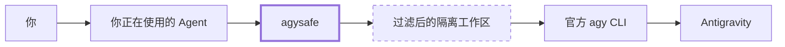
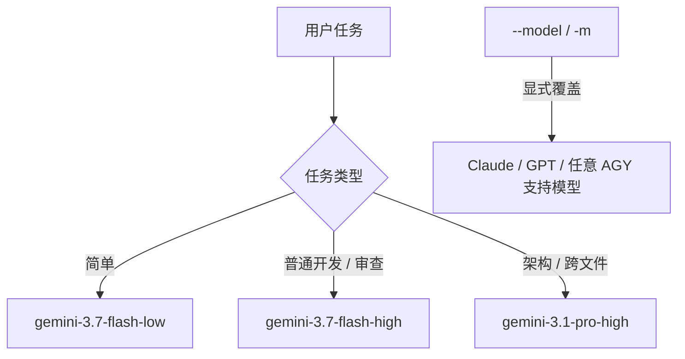
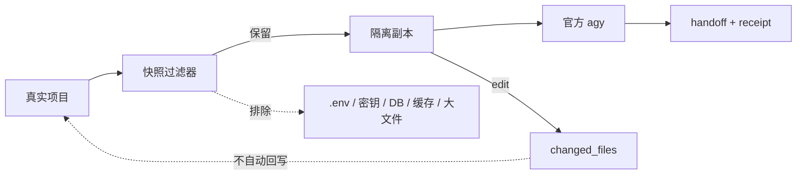

<div align="center">

# 🛡️ AgySafe

### 把你已经拥有的 Antigravity 权益，用在你真正习惯的 Coding Agent 里。

**官方 AGY CLI · 不绑定单一 Agent · 本地优先 · 默认安全**

[](CHANGELOG.md)
[](#运行要求)
[](#它是怎么工作的)
[](LICENSE)
[](SECURITY.md)

[English](README.md) · [文档中心](docs/README.md) · [快速上手](docs/QUICKSTART.md) · [架构设计](docs/ARCHITECTURE.md) · [故障排查](docs/TROUBLESHOOTING.md) · [让 Agent 帮你配置](docs/AGENT_SETUP.md)

</div>

---

## AgySafe 是什么？

你可能已经拥有 Google AI / Antigravity 的使用权益，但真正每天工作的地方却是：

**OpenCode、Codex、Claude Code、Gemini CLI、Cursor，或者其他 Coding Agent。**

AgySafe 做的事情很简单：

> **让你正在使用的 Agent，通过一个统一、安全、本地的入口调用官方 AGY。**



AgySafe 不想成为另一个庞大的 AI 框架。

它的核心故意保持很小：

```text
一个稳定 CLI
+ 一个安全层
+ 多个很薄的 Agent 入口
```

---

# 🎯 它解决什么问题？

| 原来的问题 | AgySafe 的处理方式 |
|---|---|
| 自己习惯的 Agent 不能直接利用 AGY 工作流 | 任何能运行终端命令的 Agent 都能调用 `agysafe` |
| 每换一个 Agent 就要重新做一套集成 | 所有 Agent 都调用同一个 Universal CLI |
| 项目目录可能直接暴露给外部工具 | review/edit 默认使用过滤后的隔离副本 |
| `.env`、密钥、本地数据库可能被顺手带出去 | 自动过滤常见敏感文件与高置信度凭据 |
| 网络问题、AGY 问题、本地代码问题容易混在一起 | 返回明确状态，例如 `NETWORK_ERROR` |
| 安装配置对普通用户不够友好 | 可以直接让自己的 Agent 帮你安装和排查 |

---

# ✨ 核心能力

| | 功能 | 说明 |
|---|---|---|
| 🤖 | **Agent 无关** | 核心不属于 OpenCode、Codex 或其他某一个宿主 |
| 🧠 | **Gemini-first 自动选模型** | 默认 `Model=auto` 高强度优先使用 Gemini；Claude/GPT 只有显式 `--model` / `-m` 才会调用 |
| 🎛️ | **手动指定模型** | 随时用 `--model` / `-m` 覆盖自动选择 |
| 📦 | **隔离快照** | 审查和修改默认发生在真实项目的隔离副本 |
| 🔐 | **Secret Filter** | 自动排除 `.env`、私钥、凭据、常见数据库等 |
| 🧹 | **项目降噪** | 自动跳过 `.git`、依赖、缓存、虚拟环境、大文件 |
| 🪟 | **Windows 友好** | 处理 PowerShell 5.1 编码、`NUL/CON/COM1` 等特殊情况 |
| 🧾 | **结构化回执** | Agent 可通过 JSON 获得模型、模式、状态、workspace 等信息 |
| 🧯 | **明确失败** | 网络、区域、权限、workspace、无输出等不会伪装成成功 |
| 🔌 | **薄适配层** | Agent 入口只负责翻译用户意图，不复制 AgySafe 核心 |

---

# 🚀 快速上手

## 运行要求

- Windows
- Windows PowerShell 5.1+
- 已安装官方 `agy` CLI
- 当前机器已经具备可用的 AGY 官方认证状态

## 1. 安装

```powershell
.\install.ps1
```

安装器会自动：

- 运行本地 fake-AGY 自测；
- 检查官方 `agy`；
- 安装全局 `agysafe` 命令；
- 准备 AgySafe 隔离工作区；
- 按环境安装可用的 Agent 集成。

安装后请重启已经打开的 Agent，让它们继承新的 PATH。

## 2. 通用使用

默认自动模式 + 自动模型：

```text
agysafe "审查一下当前项目"
```

手动指定模型：

```text
agysafe --model claude-sonnet-4-6 "审查一下当前项目"
```

短写：

```text
agysafe -m gemini-3.1-pro-high "分析整个项目架构"
```

给 Agent 使用 JSON：

```text
agysafe --workspace "." --json "审查一下当前项目"
```

## 3. 在 Agent 里直接用

### OpenCode / OpenCode CLI

```text
/agy 审查一下当前项目
```

### Gemini CLI

```text
/agy review the current project
```

### Codex / Codex CLI

```text
使用 AgySafe 审查一下当前项目
```

---

# 🪄 不想自己配置？让你的 Agent 帮你

这是 AgySafe 很重要的一种使用方式。

你可以把仓库交给 Codex、OpenCode、Claude Code 或其他有终端权限的 Agent，然后直接粘贴：

```text
请帮我配置这个 AgySafe 项目。

要求：
1. 先阅读 README_CN.md、README.md 和 docs/AGENT_SETUP.md。
2. 检查官方 agy CLI 是否存在，并确认 `agy --version` 可以运行。
3. 执行仓库里的 `install.ps1`。
4. 不要自行替换 AGY 官方认证方式，不要引入反向代理，不要修改无关系统设置。
5. 安装后检查 `agysafe --doctor`。
6. 只运行项目文档规定的短测试，不要一上来就反复跑十分钟级审查。
7. 如果失败，先判断问题属于 Agent 集成、AgySafe、workspace、官方 AGY 还是网络/服务，再决定是否修改代码。
8. 最后告诉我你具体做了什么。
```

更多可直接复制的提示词：

**[→ Agent 自动配置指南](docs/AGENT_SETUP.md)**

---

# 🧩 支持哪些 Agent？

AgySafe 把“核心兼容”和“宿主便利功能”分开。

## 第一方适配

| Agent | 接入方式 | 常见用法 |
|---|---|---|
| OpenCode | `/agy` + Agent Skill | `/agy 审查当前项目` |
| OpenCode CLI | `/agy` + Agent Skill | `/agy 审查当前项目` |
| Codex | Agent Skill + `AGENTS.md` | `使用 AgySafe...` |
| Codex CLI | Agent Skill + `AGENTS.md` | `使用 AgySafe...` |
| Gemini CLI | 全局 `/agy` 自定义命令 | `/agy ...` |
| Claude Code | `CLAUDE.md` 指令集成 | `使用 AgySafe...` |
| Cursor / Cursor CLI | instruction 模板 + CLI | `agysafe ...` |

## Universal CLI

只要 Agent 能执行本地终端命令，就可以：

```text
agysafe --workspace "." --json "<任务>"
```

因此 Windsurf、Cline、Roo Code、Continue、Aider，以及类似的终端型 Agent，都不需要 AgySafe 为它重新实现核心。

> Agent 的插件格式可能变化。  
> **真正稳定的兼容契约是 `agysafe` CLI。**

完整设计：

**[→ Agent 集成架构](docs/AGENT_INTEGRATION.md)**

---

# 🧠 自动模型选择

默认：

```text
Model=auto
Mode=auto
```

AgySafe 根据任务做一个轻量的 **Gemini-first** 路由。自动模式不会因为提示词里写了 Claude/GPT 就隐式消耗这些稀缺额度；需要时请显式指定模型。



例如：

```text
agysafe -m gemini-3.1-pro-high "分析整个架构"
agysafe -m claude-sonnet-4-6 "深度审查这个模块"
```

> AgySafe 审查的是 `--workspace` 指向的**本地工作区**。提示词里的 GitHub URL 目前只是上下文，v1.0.1 不会自动 clone 或切换仓库。

---

# 🔐 默认安全

对于项目审查和修改任务，AgySafe 默认**不把真实项目直接交给 AGY**。



默认保护包括：

- 项目隔离副本；
- 敏感文件过滤；
- 高置信度密钥/Token 过滤；
- Secret 类环境变量清理；
- 依赖、缓存、构建目录过滤；
- sandbox；
- 不添加危险权限绕过；
- edit 模式不会自动把修改写回真实项目。

详细说明：

**[SECURITY.md](SECURITY.md)**

---

# ⚙️ 它是怎么工作的？

AgySafe 只有四层：

```text
┌───────────────────────────────────────────────┐
│ Agent 入口                                    │
│ /agy · Agent Skill · AGENTS.md · terminal     │
├───────────────────────────────────────────────┤
│ Universal CLI                                 │
│ agysafe --model auto --mode auto ...          │
├───────────────────────────────────────────────┤
│ 安全与路由                                    │
│ snapshot · secrets · model · status           │
├───────────────────────────────────────────────┤
│ 官方运行时                                    │
│ agy CLI → Antigravity                         │
└───────────────────────────────────────────────┘
```

AgySafe **不重新实现 Antigravity 协议，不自己维护一套登录系统，也不做代理转发层**。

这样做的目的只有一个：

> **让核心足够小，兼容面足够大。**

详细架构：

**[→ ARCHITECTURE.md](docs/ARCHITECTURE.md)**

---

# 🧯 出问题怎么办？

先不要改代码。

先运行：

```text
agysafe --doctor
```

然后用短 smoke test，而不是不停跑完整项目审查：

```text
agysafe --workspace "." --json --timeout 2 "只回复 OK"
```

常见状态：

| 状态 | 含义 |
|---|---|
| `SUCCESS` | 正常完成 |
| `QUOTA_EXCEEDED` | AGY / 服务额度耗尽；回执可提供 reset 提示与 Gemini fallback |
| `NETWORK_ERROR` | 官方 AGY / 服务 / 网络连接失败 |
| `REGION_UNSUPPORTED` | 服务返回地区限制 |
| `WORKSPACE_ERROR` | AGY 没有正确看到隔离 workspace |
| `PERMISSION_DENIED` | 所需操作被拒绝 |
| `NO_OUTPUT` | 进程结束但没有可用结果 |
| `INCOMPLETE` | AGY 即使 exit code=0，也没有真正输出最终审查/结果 |
| `NO_CHANGES` | edit 模式未产生修改 |
| `SNAPSHOT_EMPTY` | 过滤后没有可委托的项目文件 |

---

# 🧑‍🔧 让你的 Agent / ChatGPT 帮你排查

可以直接把下面这段交给你正在使用的 Agent：

```text
请帮我诊断 AgySafe，但先不要修改 AgySafe 源码。

请把问题归类到以下某一层：
1. 宿主 Agent 集成；
2. AgySafe CLI / 安装 / PATH；
3. snapshot / workspace 隔离；
4. 官方 agy CLI；
5. 认证 / 网络 / 服务 / 地区。

只收集必要证据：
- `Get-Command agysafe`
- `agysafe --doctor`
- `agy --version`
- 最近一次 AgySafe JSON receipt / 错误
- 必要时执行一次：
  `agysafe --workspace "." --json --timeout 2 "只回复 OK"`

不要反复执行长时间 AGY 任务。
只有证据明确表明问题在 AgySafe 本身时，才修改源码。
修改前先告诉我根因。
```

完整排查树：

**[→ TROUBLESHOOTING.md](docs/TROUBLESHOOTING.md)**

---

# ✅ 已验证内容

v1.0.0 已经实际验证：

- **OpenCode**：完整项目 review、自动模型、隔离快照、过滤、真实 AGY 结果；
- **Codex**：Universal CLI、自动模型、真实 AGY smoke test。

v1.0.1 扩展了 Windows hermetic self-test，覆盖 review/edit 隔离、Secret Filter、手动模型覆盖、`--doctor`、quota 分类与 incomplete 检测。推送或 PR 后，GitHub Actions 会在 `windows-latest` 上执行这套测试。

这是一个年轻项目，但核心链路已经能够实际工作。

---

# 🗂️ 项目结构

```text
AgySafe/
├─ bin/                         # Universal CLI 与核心 runtime
├─ integrations/                # 各 Agent 的薄适配
├─ docs/                        # 架构、配置、故障排查
├─ tests/                       # fake-AGY 自测
├─ .github/                     # CI / Issue / PR 模板
├─ install.ps1
├─ uninstall.ps1
├─ SECURITY.md
├─ CONTRIBUTING.md
└─ README.md
```

---

# 🧭 项目理念

AgySafe 坚持五条原则：

### 1. 官方 Runtime 优先
能调用官方 AGY，就不重新实现 Antigravity 协议。

### 2. 一个核心，多个 Agent
不同 Agent 只做入口，不复制认证、workspace 和路由逻辑。

### 3. 默认安全，但不打扰用户
日常用户只需要输入任务，安全策略在后台自动发生。

### 4. 默认自动，需要时可控
平时自动选模式和模型，高级用户随时手动覆盖。

### 5. 先诊断，再改代码
网络故障不应该变成一个新的 AgySafe 版本。

---

# 🛣️ Roadmap

- [x] Windows Universal CLI
- [x] OpenCode 集成
- [x] Codex 集成
- [x] Gemini CLI `/agy`
- [x] Claude Code 指令集成
- [x] Cursor / Generic Agent 模板
- [x] 自动模型 + 手动模型
- [x] Snapshot + Secret Filter
- [x] JSON Receipt + 状态分类
- [x] Windows GitHub Actions
- [ ] 验证更多主流 Agent
- [ ] 更顺滑的 edit → review → apply 流程
- [ ] macOS / Linux
- [ ] 更友好的安装器 UX

---

# 🤝 参与贡献

AgySafe 的价值之一就是“小”。

新增 Agent 支持之前，请先问：

> 能不能只写一个调用现有 `agysafe` CLI 的薄适配？

如果可以，就不要再造第二套核心。

详见：

**[CONTRIBUTING.md](CONTRIBUTING.md)**

---

# ⚠️ 重要说明

AgySafe 不承诺：

- 零账号风险；
- 服务永远可用；
- 绕过额度；
- 绕过地区限制；
- 绕过资格限制。

它调用官方 AGY CLI，因此仍受 Google / Antigravity 的认证、服务状态、额度、地区和相关规则约束。

---

<div align="center">

### 核心很小，但可以连接一个很大的 Agent 世界。

**你的 Agent → AgySafe → 官方 AGY**

[开始使用](docs/QUICKSTART.md) · [故障排查](docs/TROUBLESHOOTING.md) · [安全说明](SECURITY.md)

</div>
