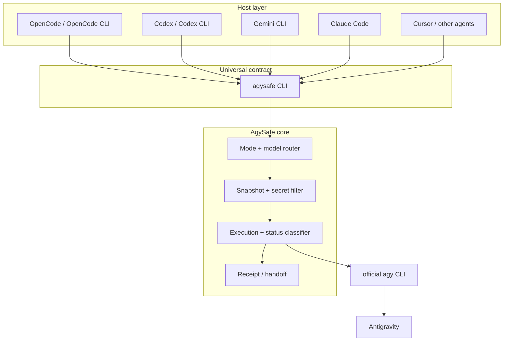
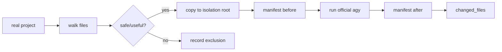

# Architecture

AgySafe is intentionally small at runtime and broad at the integration layer.

## Design goal

The project exists to provide one stable local contract between coding agents and the official AGY CLI:

```text
agent -> agysafe -> safety/routing -> official agy
```

Agent-specific integrations should never duplicate authentication, isolation, filtering, routing, or transport logic.

## Layers



## 1. Host layer

Host integrations translate a user-facing command into the universal CLI.

Examples:

```text
/agy 审查一下当前项目
```

or:

```text
Use AgySafe to review the current project.
```

become conceptually:

```text
agysafe --workspace "." --json "审查一下当前项目"
```

The host layer should remain replaceable.

## 2. Universal CLI

`agysafe` is the stable compatibility contract.

Supported options include:

```text
--model / -m
--mode
--workspace / -w
--timeout
--json
--doctor
```

Defaults:

```text
model = auto
mode  = auto
workspace = current directory
```

This is why AgySafe can support many agents without writing a new execution engine for each one.

The workspace contract is local: a URL written inside the task prompt does not replace `--workspace`. Hosts should report `real_workspace` from the receipt instead of inferring the reviewed repository from prompt text.

## 3. Mode routing

AgySafe classifies tasks into:

- `ask`
- `review`
- `edit`

The classification is deliberately lightweight.

`ask` does not need a project snapshot.

`review` uses a filtered isolated project copy and requests no modifications.

`edit` also uses a filtered isolated copy and records changed files without automatically applying them to the real project.

## 4. Model routing

Current default routing is intentionally simple and **Gemini-first**:

| Task class | Model |
|---|---|
| simple | `gemini-3.7-flash-low` |
| general development | `gemini-3.7-flash-high` |
| normal review | `gemini-3.7-flash-high` |
| architecture/cross-file/deep architecture | `gemini-3.1-pro-high` |

Claude, GPT, and other AGY-supported models are **explicit-only** in v1.0.1. Mentioning a model name inside the task does not spend that model's quota automatically; use `--model` / `-m` when you actually want it.

Manual `--model` always overrides automatic routing.

This is a policy layer, not an AGY protocol feature, and may evolve independently.

## 5. Snapshot pipeline

For `review` and `edit`:



Common exclusions:

- `.git`
- `node_modules`
- virtual environments
- caches
- `.env`
- keys/certificates
- credential/secrets files
- local databases
- very large files
- Windows reserved device names

A single file-copy failure is recorded and skipped instead of aborting the entire snapshot.

## 6. Isolation root

AgySafe uses:

```text
%USERPROFILE%\AgySafeWorkspaces
```

Runs are stored under timestamped/id directories.

The real project remains separate.

## 7. Official AGY execution

AgySafe intentionally delegates to the official CLI instead of implementing an Antigravity transport.

Conceptually:

```text
agy -p <task> --add-dir <isolated-workspace> --model <selected-model> --sandbox
```

AgySafe also launches AGY from the delegated workspace.

## 8. Structured receipts

A run can emit JSON such as:

```json
{
  "schema": "agysafe.receipt.v1",
  "status": "SUCCESS",
  "mode": "review",
  "requested_model": "auto",
  "selected_model": "gemini-3.7-flash-high",
  "snapshot_used": true,
  "real_workspace_exposed_to_agy": false,
  "changed_files": [],
  "agy_exit_code": 0
}
```

Receipts make AgySafe easier for another agent/LLM to diagnose.

## 9. Failure classification

AgySafe distinguishes common failure classes:

```text
QUOTA_EXCEEDED
NETWORK_ERROR
REGION_UNSUPPORTED
WORKSPACE_ERROR
PERMISSION_DENIED
NO_OUTPUT
INCOMPLETE
NO_CHANGES
SNAPSHOT_EMPTY
ERROR
```

This matters because the correct response to a network outage is not "rewrite AgySafe".

## Non-goals

AgySafe does not aim to:

- implement an unofficial Antigravity API;
- replace AGY authentication;
- proxy AGY traffic;
- bypass service limits;
- become a full orchestration framework;
- implement a separate core for every agent.

## Architectural rule for future contributions

When adding a host integration:

> translate into `agysafe`; do not fork the core.
