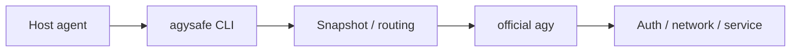

# Troubleshooting

The primary troubleshooting rule is:

> **Classify first. Patch second.**

AgySafe sits between a host agent and the official AGY CLI, so failures can originate in multiple layers.

## Failure layers



Diagnose in that order.

---

## 1. Is `agysafe` installed?

```powershell
Get-Command agysafe
```

If missing:

- restart the terminal/agent after installation;
- re-run `.\install.ps1`;
- check the user PATH.

Do not debug AGY until the `agysafe` command itself resolves.

---

## 2. Does AgySafe see official AGY?

```powershell
agysafe --doctor
```

Then:

```powershell
agy --version
```

`--doctor` is intentionally lightweight. It should not require a long project task.

---

## 3. Run a short smoke test

```powershell
agysafe --workspace "." --json --timeout 2 "只回复 OK"
```

This is preferable to repeatedly running a 10-minute repository review.

### Expected success

```json
{
  "status": "SUCCESS",
  "mode": "ask",
  "requested_model": "auto",
  "selected_model": "gemini-3.7-flash-low",
  "result": "OK"
}
```

---

# Status reference

## `SUCCESS`

AgySafe completed normally.

If the result content is poor, that is a task/model quality issue rather than an execution failure.

## `QUOTA_EXCEEDED`

AGY/service reported that the selected model or account-level bucket has reached a quota limit. The receipt may include:

```text
quota_type
reset_hint
recommended_fallback
```

For an explicitly selected Claude/GPT model, AgySafe may recommend `gemini-3.7-flash-high`. It does **not** silently rerun or switch models.

## `NETWORK_ERROR`

AgySafe launched AGY, but the AGY/service/network connection failed.

Check:

```powershell
agy -p "只回复 OK" --model gemini-3.7-flash-low --print-timeout 2m
```

If direct AGY also fails, do not patch AgySafe.

## `REGION_UNSUPPORTED`

The service reported a location restriction.

This is not a workspace bug.

AgySafe does not bypass region restrictions.

## `WORKSPACE_ERROR`

AGY reported that it could not access/use the delegated workspace.

Inspect the receipt:

```text
delegated_workspace
snapshot_used
included_file_count
excluded_files
```

Verify that the delegated workspace contains the expected project files.

## `PERMISSION_DENIED`

AGY or its headless environment denied an operation.

AgySafe deliberately does not add dangerous permission-bypass flags.

Check whether the task can be completed with workspace file tools.

## `NO_OUTPUT`

The process returned without usable output.

Check direct AGY behavior and the run's handoff file.

## `INCOMPLETE`

A review ended with planning/synthesis language rather than a real final result. AgySafe can classify this as `INCOMPLETE` even when official AGY exits with code 0.

This has been observed on long agentic reviews where research/tool work completed but the final report was never emitted.

Try a shorter task or a different model once; do not automatically loop retries.

## `NO_CHANGES`

Edit mode produced no changed files.

Possible explanations:

- the task did not require a change;
- AGY could not edit;
- the requested change was already present.

Inspect the result text.

## `SNAPSHOT_EMPTY`

Nothing safe/useful remained after filtering.

Inspect `excluded_files`.

The repository may consist mostly of generated, sensitive, database, dependency, or oversized files.

---

# GitHub URL in the task reviewed the wrong project

AgySafe v1.0.1 does not automatically clone a repository from a URL embedded in the task. The actual target is the local `--workspace` supplied by the host.

Check the receipt:

```text
real_workspace
workspace_source
workspace_note
```

OpenCode `/agy` should surface `real_workspace` rather than claiming that a prompt URL was the reviewed repository.

---

# Host-agent-specific failures

## OpenCode appears to call an old AgySafe

Symptoms can include fields/output not present in the current release.

Re-run the current `install.ps1` and restart OpenCode.

v1 clean installation removes the AgySafe-owned legacy skill directory before installing the current integration.

Verify the actual universal command separately:

```powershell
agysafe --workspace "." --json --timeout 2 "只回复 OK"
```

## Codex times out on a long review

First verify the short CLI path:

```text
agysafe --workspace "." --json --timeout 2 "只回复 OK"
```

If that succeeds, Codex integration works.

A 10-minute project review can still exceed a host terminal/tool execution window.

Do not classify that as "Codex unsupported" without testing the short path.

---

# Ask an AI agent to diagnose it

Paste:

```text
Diagnose this AgySafe problem without editing source code first.

Classify the failure into:
1. host-agent integration;
2. AgySafe CLI/PATH;
3. snapshot/workspace;
4. official agy CLI;
5. auth/network/service/region.

Collect only:
- `Get-Command agysafe`
- `agysafe --doctor`
- `agy --version`
- latest JSON receipt/error
- one short smoke test if needed

Do not repeatedly execute long AGY tasks.
Only patch AgySafe if the evidence points to AgySafe itself.
```

---

# Useful run data

A receipt includes fields such as:

```text
status
mode
requested_model
selected_model
real_workspace
delegated_workspace
snapshot_used
included_file_count
excluded_file_count
excluded_files
changed_files
agy_exit_code
handoff_path
result
elapsed_seconds
```

This is usually enough for another agent or ChatGPT-like model to classify the issue without seeing your credentials.

## Privacy note

Before posting a receipt publicly, inspect local paths and task/result content.

AgySafe filters many secrets from delegated project snapshots, but a diagnostic receipt may still include local filesystem paths and model output.
